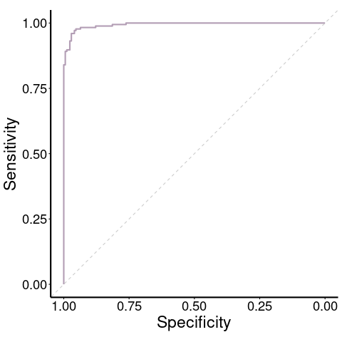
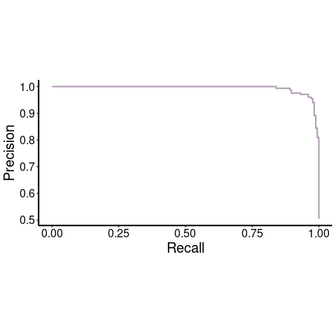
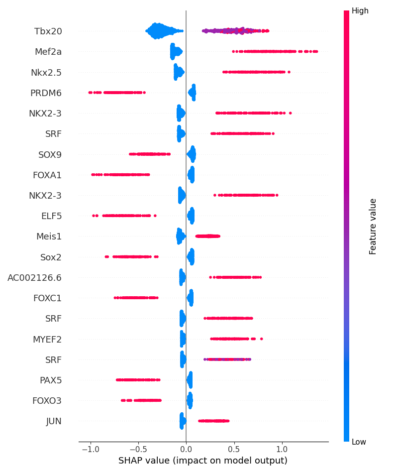
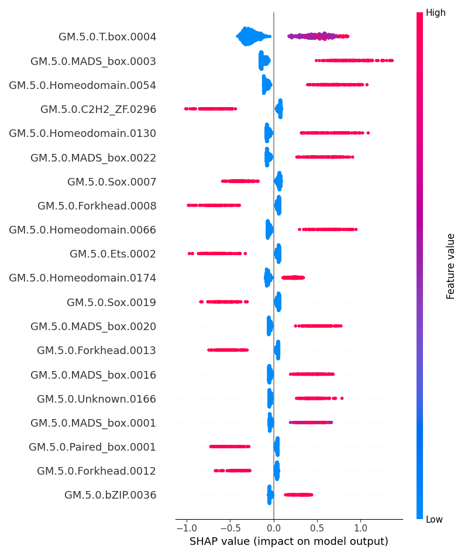
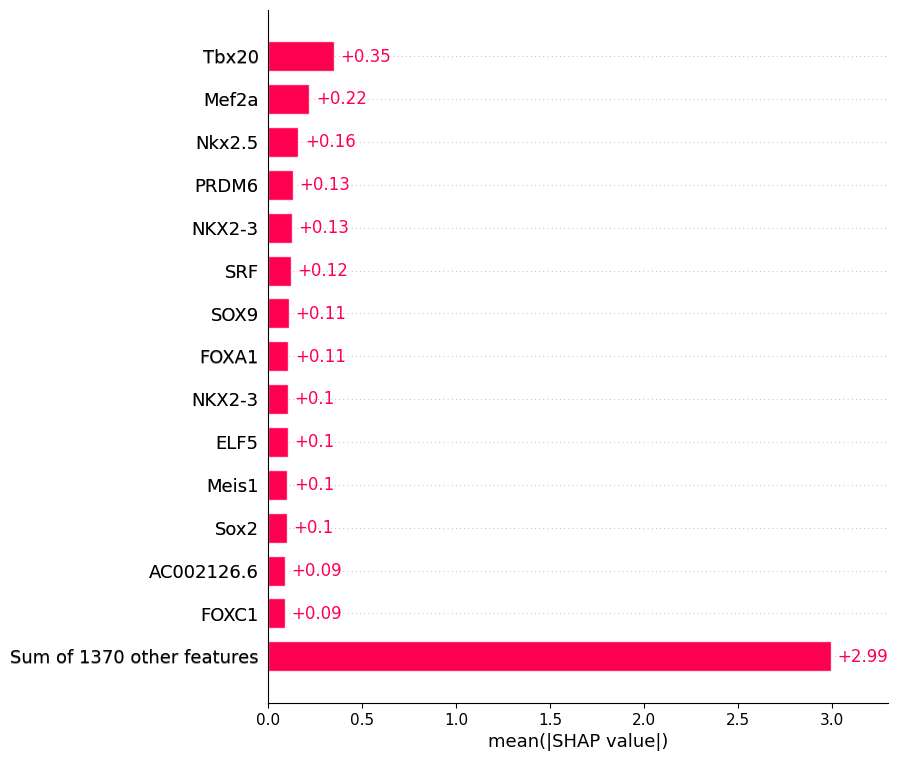
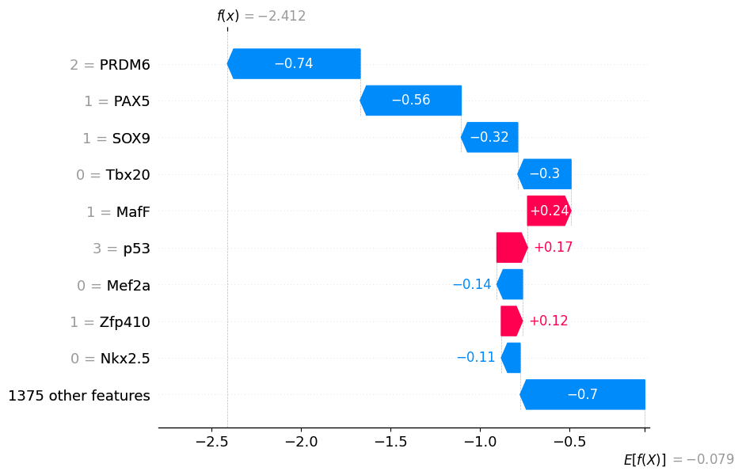
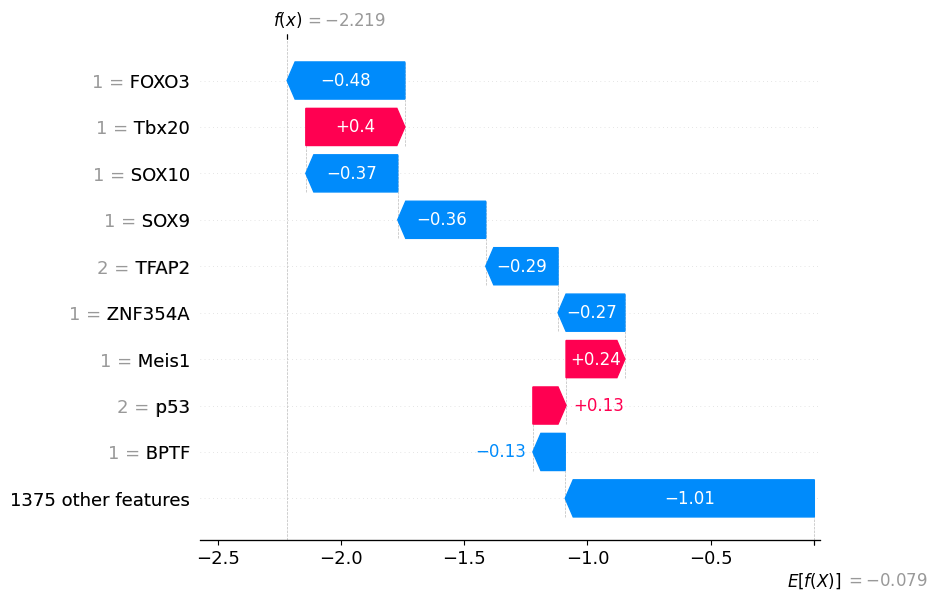
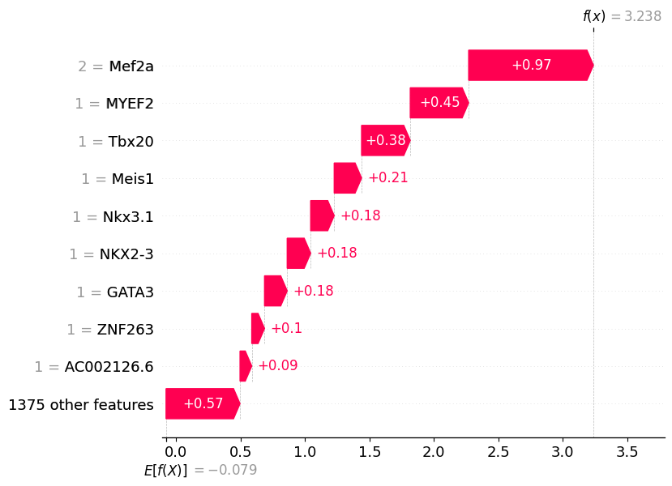

# Bag-of-Motifs tutorial for binary classification

For this tutorial we are going to train binary a model to predict mouse cardiomyocyte specific candidate regulatory elements (CRE) from background CRE from other 16 cell types. For this, we will use the snATAC-seq data from Pijuan-Sala et al 2020 [1].

snATAC-seq peaks were annotated to cell types based on their differential accessibility compared to other cell types, as defined using an exact Fisher's test based methodology. The reference genome of these peaks is mm10.


We start by reading the snATAC-seq peaks coordinates and annotation provided in Supplementary Table 6. The cell type annotation is indicated in the column "celltype_specificity". Some snATAC-seq peaks were annotated to multiple cell types. For instance, the peak with ID "chr10_100065973_100066492" was annotated to NMP and Spinal cord (NMP;Spinal cord).


```python
mouseE8.25 <- read.csv(file = "Pijuan_etal_table_S6.csv"
                       , header = T, stringsAsFactors = F)
head(mouseE8.25, 3)
```


<table class="dataframe">
<caption>A data.frame: 3 × 18</caption>
<thead>
	<tr><th></th><th scope=col>peakID</th><th scope=col>peak_chr</th><th scope=col>peak_start</th><th scope=col>peak_end</th><th scope=col>Annotation.General</th><th scope=col>distance_from_TSS</th><th scope=col>geneName</th><th scope=col>geneID</th><th scope=col>strand</th><th scope=col>celltype_specificity</th><th scope=col>topic</th><th scope=col>topic_stringent</th><th scope=col>accessibility</th><th scope=col>accessibility_log</th><th scope=col>accessibility_ratio</th><th scope=col>umap_X</th><th scope=col>umap_Y</th><th scope=col>Pattern_endothelium</th></tr>
	<tr><th></th><th scope=col>&lt;chr&gt;</th><th scope=col>&lt;chr&gt;</th><th scope=col>&lt;int&gt;</th><th scope=col>&lt;int&gt;</th><th scope=col>&lt;chr&gt;</th><th scope=col>&lt;chr&gt;</th><th scope=col>&lt;chr&gt;</th><th scope=col>&lt;chr&gt;</th><th scope=col>&lt;chr&gt;</th><th scope=col>&lt;chr&gt;</th><th scope=col>&lt;chr&gt;</th><th scope=col>&lt;chr&gt;</th><th scope=col>&lt;int&gt;</th><th scope=col>&lt;dbl&gt;</th><th scope=col>&lt;dbl&gt;</th><th scope=col>&lt;dbl&gt;</th><th scope=col>&lt;dbl&gt;</th><th scope=col>&lt;int&gt;</th></tr>
</thead>
<tbody>
	<tr><th scope=row>1</th><td>chr10_100010238_100010739</td><td>10</td><td>100010238</td><td>100010739</td><td>Intergenic</td><td>4891 </td><td>Kitl   </td><td>ENSMUSG00000019966</td><td>1</td><td>NA</td><td>Topic7;Topic76                                                       </td><td>Nonspecific</td><td> 174</td><td>5.164786</td><td>0.008944636</td><td>-0.6249963</td><td>-0.1993816</td><td>NA</td></tr>
	<tr><th scope=row>2</th><td>chr10_100010238_100010739</td><td>10</td><td>100010238</td><td>100010739</td><td>Intergenic</td><td>21617</td><td>Gm17870</td><td>ENSMUSG00000112299</td><td>1</td><td>NA</td><td>Topic7;Topic76                                                       </td><td>Nonspecific</td><td> 174</td><td>5.164786</td><td>0.008944636</td><td>-0.6249963</td><td>-0.1993816</td><td>NA</td></tr>
	<tr><th scope=row>3</th><td>chr10_100015130_100016035</td><td>10</td><td>100015130</td><td>100016035</td><td>TSS       </td><td>TSS  </td><td>Kitl   </td><td>ENSMUSG00000019966</td><td>1</td><td>NA</td><td>Topic1;Topic4;Topic19;Topic35;Topic42;Topic49;Topic67;Topic77;Topic89</td><td>Nonspecific</td><td>1901</td><td>7.550661</td><td>0.097722716</td><td> 8.0779510</td><td> 2.6288185</td><td>NA</td></tr>
</tbody>
</table>


We start processing this data by removing all the peaks that were not annotated to a cell type. 


```python
mouseE8.25 <- mouseE8.25[!is.na(mouseE8.25$celltype_specificity),]
head(mouseE8.25, 3)
```


<table class="dataframe">
<caption>A data.frame: 3 × 18</caption>
<thead>
	<tr><th></th><th scope=col>peakID</th><th scope=col>peak_chr</th><th scope=col>peak_start</th><th scope=col>peak_end</th><th scope=col>Annotation.General</th><th scope=col>distance_from_TSS</th><th scope=col>geneName</th><th scope=col>geneID</th><th scope=col>strand</th><th scope=col>celltype_specificity</th><th scope=col>topic</th><th scope=col>topic_stringent</th><th scope=col>accessibility</th><th scope=col>accessibility_log</th><th scope=col>accessibility_ratio</th><th scope=col>umap_X</th><th scope=col>umap_Y</th><th scope=col>Pattern_endothelium</th></tr>
	<tr><th></th><th scope=col>&lt;chr&gt;</th><th scope=col>&lt;chr&gt;</th><th scope=col>&lt;int&gt;</th><th scope=col>&lt;int&gt;</th><th scope=col>&lt;chr&gt;</th><th scope=col>&lt;chr&gt;</th><th scope=col>&lt;chr&gt;</th><th scope=col>&lt;chr&gt;</th><th scope=col>&lt;chr&gt;</th><th scope=col>&lt;chr&gt;</th><th scope=col>&lt;chr&gt;</th><th scope=col>&lt;chr&gt;</th><th scope=col>&lt;int&gt;</th><th scope=col>&lt;dbl&gt;</th><th scope=col>&lt;dbl&gt;</th><th scope=col>&lt;dbl&gt;</th><th scope=col>&lt;dbl&gt;</th><th scope=col>&lt;int&gt;</th></tr>
</thead>
<tbody>
	<tr><th scope=row>16</th><td>chr10_100039521_100040377</td><td>10</td><td>100039521</td><td>100040377</td><td>intron    </td><td>gene  </td><td>Kitl</td><td>ENSMUSG00000019966</td><td>1</td><td>Pharyngeal mesoderm</td><td>Topic8;Topic35;Topic48;Topic59;Topic73;Topic95</td><td>Nonspecific</td><td>821</td><td>6.711740</td><td>0.04220429</td><td>-4.188722</td><td>2.789243</td><td>NA</td></tr>
	<tr><th scope=row>24</th><td>chr10_100065973_100066492</td><td>10</td><td>100065973</td><td>100066492</td><td>intron    </td><td>gene  </td><td>Kitl</td><td>ENSMUSG00000019966</td><td>1</td><td>NMP;Spinal cord    </td><td>Topic84;Topic96;Topic100                      </td><td>Nonspecific</td><td>581</td><td>6.366470</td><td>0.02986686</td><td> 3.638221</td><td>2.657099</td><td>NA</td></tr>
	<tr><th scope=row>36</th><td>chr10_100128033_100128872</td><td>10</td><td>100128033</td><td>100128872</td><td>Intergenic</td><td>112403</td><td>Kitl</td><td>ENSMUSG00000019966</td><td>1</td><td>Forebrain          </td><td>Topic26;Topic46;Topic51;Topic74;Topic96       </td><td>Nonspecific</td><td>580</td><td>6.364751</td><td>0.02981545</td><td> 3.914542</td><td>2.334110</td><td>NA</td></tr>
</tbody>
</table>


Next, we keep only the peaks annotated to a single cell type. Peaks were annotated to multiple cell types in which the differential accessibility was significant according to the Fisher's exact tests. 


```python
mouseE8.25 <- mouseE8.25[!grepl(pattern = ";", x = mouseE8.25$celltype_specificity),]
```

Then we keep only the peak coordinates and cell type annotation and remove any duplicated peaks.


```python
dim(mouseE8.25)
dim(unique(mouseE8.25[,c("peak_chr", "peak_start", "peak_end", "celltype_specificity")]))
mouseE8.25 <- unique(mouseE8.25[,c("peak_chr", "peak_start", "peak_end", "celltype_specificity")])
dim(mouseE8.25)
```


<style>
.list-inline {list-style: none; margin:0; padding: 0}
.list-inline>li {display: inline-block}
.list-inline>li:not(:last-child)::after {content: "\00b7"; padding: 0 .5ex}
<ol class=list-inline><li>19291</li><li>18</li></ol>
</style>


<style>
.list-inline {list-style: none; margin:0; padding: 0}
.list-inline>li {display: inline-block}
.list-inline>li:not(:last-child)::after {content: "\00b7"; padding: 0 .5ex}
</style>
<ol class=list-inline><li>15504</li><li>4</li></ol>


<style>
.list-inline {list-style: none; margin:0; padding: 0}
.list-inline>li {display: inline-block}
.list-inline>li:not(:last-child)::after {content: "\00b7"; padding: 0 .5ex}
</style>
<ol class=list-inline><li>15504</li><li>4</li></ol>


We can have a look at the number of peaks annotated to each cell type. 


```python
as.data.frame(table(mouseE8.25$celltype_specificity))
```


<table class="dataframe">
<caption>A data.frame: 19 × 2</caption>
<thead>
	<tr><th scope=col>Var1</th><th scope=col>Freq</th></tr>
	<tr><th scope=col>&lt;fct&gt;</th><th scope=col>&lt;int&gt;</th></tr>
</thead>
<tbody>
	<tr><td>Allantois          </td><td> 433</td></tr>
	<tr><td>Cardiomyocytes     </td><td>1077</td></tr>
	<tr><td>Endothelium        </td><td>2153</td></tr>
	<tr><td>Erythroid          </td><td>1342</td></tr>
	<tr><td>ExE endoderm       </td><td> 247</td></tr>
	<tr><td>Forebrain          </td><td> 578</td></tr>
	<tr><td>Gut                </td><td> 812</td></tr>
	<tr><td>Mesenchyme         </td><td> 620</td></tr>
	<tr><td>Mid/Hindbrain      </td><td> 457</td></tr>
	<tr><td>Mixed mesoderm     </td><td> 164</td></tr>
	<tr><td>NMP                </td><td>1167</td></tr>
	<tr><td>Neural crest       </td><td> 733</td></tr>
	<tr><td>Notochord          </td><td>  71</td></tr>
	<tr><td>Paraxial mesoderm  </td><td> 857</td></tr>
	<tr><td>Pharyngeal mesoderm</td><td> 398</td></tr>
	<tr><td>Somitic mesoderm   </td><td>1461</td></tr>
	<tr><td>Spinal cord        </td><td>1277</td></tr>
	<tr><td>Surface ectoderm   </td><td> 800</td></tr>
	<tr><td>Ubiquitous         </td><td> 857</td></tr>
</tbody>
</table>


As we are going to train a model to distinguish cell type-specific CRE, we want to confirm that the peaks don't overlap between them. 


```python
suppressMessages(library(GenomicRanges))
head(mouseE8.25,2)
mouseE8.25_gr <- with(mouseE8.25, GRanges(peak_chr, IRanges(peak_start+1, peak_end)))
print(mouseE8.25_gr)
mouseE8.25_gr <- sort(mouseE8.25_gr)
x <- as.data.frame(GenomicRanges::findOverlaps(mouseE8.25_gr, mouseE8.25_gr))
x[x$queryHits != x$subjectHits,]
```


<table class="dataframe">
<caption>A data.frame: 2 × 4</caption>
<thead>
	<tr><th></th><th scope=col>peak_chr</th><th scope=col>peak_start</th><th scope=col>peak_end</th><th scope=col>celltype_specificity</th></tr>
	<tr><th></th><th scope=col>&lt;chr&gt;</th><th scope=col>&lt;int&gt;</th><th scope=col>&lt;int&gt;</th><th scope=col>&lt;chr&gt;</th></tr>
</thead>
<tbody>
	<tr><th scope=row>16</th><td>10</td><td>100039521</td><td>100040377</td><td>Pharyngeal mesoderm</td></tr>
	<tr><th scope=row>36</th><td>10</td><td>100128033</td><td>100128872</td><td>Forebrain          </td></tr>
</tbody>
</table>


    GRanges object with 15504 ranges and 0 metadata columns:
              seqnames              ranges strand
                 <Rle>           <IRanges>  <Rle>
          [1]       10 100039522-100040377      *
          [2]       10 100128034-100128872      *
          [3]       10 100164376-100164876      *
          [4]       10 100200407-100201011      *
          [5]       10 100264020-100264523      *
          ...      ...                 ...    ...
      [15500]        X   96025747-96026252      *
      [15501]        X   99204441-99204941      *
      [15502]        X   99220568-99221093      *
      [15503]        X   99544351-99544927      *
      [15504]        X   99550382-99551008      *
      -------
      seqinfo: 21 sequences from an unspecified genome; no seqlengths


<table class="dataframe">
<caption>A data.frame: 0 × 2</caption>
<thead>
	<tr><th scope=col>queryHits</th><th scope=col>subjectHits</th></tr>
	<tr><th scope=col>&lt;int&gt;</th><th scope=col>&lt;int&gt;</th></tr>
</thead>
<tbody>
</tbody>
</table>


Once we confirmed that the snATAC-seq peaks don't overlap with others we can save the peaks to a bed file.


```python
write.table(x = mouseE8.25, file = "mouseE8.25_peaks.bed", col.names = F, row.names = F
            , quote = F, sep = '\t')

```

Next, we will use the script "filter_CREs.R" to filter the peaks. We can carry out multiple tasks with this script, like keeping only regions that are proximal to a transcription start site (TSS), or keep only regions located distally. We can also remove any regions overlapping exons or adjust the width of the regions to ensure concistency. For the aim of this tutorial we are going to remove the peaks located within 1kb from a TSS and the peaks overlapping exons. Finally, we adjust the width of the peaks to 500bp.

We can display the help of this script to look at all the options. 


```python
Rscript filter_CREs.R --help
```

    Usage: filter_CREs.R [parameters]
    
    Parameters:
    --input_bed=<file> input BED file
    --annot=<file> assembly annotation file (.gtf) 
    --chr_sizes=<file> File with chromosome length values 
    --u=<integer>   Number of base pairs upstream of TSS for the definition of proximal regions
    --d=<integer>   Number of base pairs downstream of TSS for the definition of proximal regions
    --nbp=<integer> Number of central base pairs in adjusted CREs 
    --out_bed=<file> output BED file
    --keep_proximal=<logical> whether only proximal regions to TSS should be retained (default: FALSE)
    --remove_proximal=<logical> whether proximal regions to TSS should be removed (default: FALSE)
    --non_exonic=<logical> whether regions overlapping exons should be removed (default: FALSE)
    --help                           Display this help message
    


We provide the bed file that we created before with the argument "--input_bed". We need to provide a .gtf file containing the genome annotation (--annot). We set --remove_proximal and --non_exonic to True to remove peaks proximal to a TSS and exonic peaks, respectively. We set --u and --d to 1000, these parameters denote the number of base pairs upstream and downstream of a TSS for the definition of proximal regions. 

We determine the final width of the peaks to be all 500bp (--nbp=500). In relationship with the previous argument, we provide a file containing the length of every chromosome in the reference genome to make sure that by adjusting the width of the peaks we are not exceeding the limits of the chromosomes (parameter --chr_sizes). The script will trim or extend the peaks from their centre to the specified width. Finally, we provide a name for the output bed file that will contain the filtered peaks (--out_bed).


```python
Rscript filter_CREs.R --input_bed=mouseE8.25_peaks.bed --annot=/g/data/zk16/cc3704/mouse_data/Mus_musculus.GRCm38.92.gtf \
--remove_proximal=True --non_exonic=True --u=1000 --d=1000 --nbp=500 --chr_sizes=/g/data/zk16/cc3704/mouse_data/mouse_sizes_primary_genome_tab.txt \
--out_bed=mouseE8.25_peaks_filt.bed

```

    Loading packages...
    Possible Ensembl SSL connectivity problems detected.
    Please see the 'Connection Troubleshooting' section of the biomaRt vignette
    vignette('accessing_ensembl', package = 'biomaRt')Error in curl::curl_fetch_memory(url, handle = handle) : 
      SSL certificate problem: certificate has expired
    
    [?25h[?25hReading CREs...
    [?25h[?25h[?25hReading genome annotation...
    Import genomic features from the file as a GRanges object ... OK
    Prepare the 'metadata' data frame ... OK
    Make the TxDb object ... OK
    Removing exonic regions...
    Removing proximal regions to TSSs...
    Warning message:
    In .get_cds_IDX(mcols0$type, mcols0$phase) :
      The "phase" metadata column contains non-NA values for features of type
      stop_codon. This information was ignored.
    [?25hReading chromosome sizes...
    Adjusting CRE length...
    [?25hSaving CREs...
    [?25h[?25h[?25hDone
    [?25h[?25h

After filtering, we can see the number of CRE remaining per cell type.


```python
filtered <- read.table(file = "mouseE8.25_peaks_filt.bed", header=F, stringsAsFactors=F, sep ='\t')
head(filtered)
```


<table class="dataframe">
<caption>A data.frame: 6 × 4</caption>
<thead>
	<tr><th></th><th scope=col>V1</th><th scope=col>V2</th><th scope=col>V3</th><th scope=col>V4</th></tr>
	<tr><th></th><th scope=col>&lt;chr&gt;</th><th scope=col>&lt;int&gt;</th><th scope=col>&lt;int&gt;</th><th scope=col>&lt;chr&gt;</th></tr>
</thead>
<tbody>
	<tr><th scope=row>1</th><td>10</td><td>100039699</td><td>100040199</td><td>Pharyngeal mesoderm</td></tr>
	<tr><th scope=row>2</th><td>10</td><td>100128203</td><td>100128703</td><td>Forebrain          </td></tr>
	<tr><th scope=row>3</th><td>10</td><td>100164375</td><td>100164875</td><td>Gut                </td></tr>
	<tr><th scope=row>4</th><td>10</td><td>100200458</td><td>100200958</td><td>Forebrain          </td></tr>
	<tr><th scope=row>5</th><td>10</td><td>100264021</td><td>100264521</td><td>Paraxial mesoderm  </td></tr>
	<tr><th scope=row>6</th><td>10</td><td> 10052002</td><td> 10052502</td><td>Spinal cord        </td></tr>
</tbody>
</table>


```python
as.data.frame(table(filtered$V4))
```


<table class="dataframe">
<caption>A data.frame: 19 × 2</caption>
<thead>
	<tr><th scope=col>Var1</th><th scope=col>Freq</th></tr>
	<tr><th scope=col>&lt;fct&gt;</th><th scope=col>&lt;int&gt;</th></tr>
</thead>
<tbody>
	<tr><td>Allantois          </td><td> 388</td></tr>
	<tr><td>Cardiomyocytes     </td><td> 869</td></tr>
	<tr><td>Endothelium        </td><td>1768</td></tr>
	<tr><td>Erythroid          </td><td>1002</td></tr>
	<tr><td>ExE endoderm       </td><td> 179</td></tr>
	<tr><td>Forebrain          </td><td> 485</td></tr>
	<tr><td>Gut                </td><td> 635</td></tr>
	<tr><td>Mesenchyme         </td><td> 531</td></tr>
	<tr><td>Mid/Hindbrain      </td><td> 402</td></tr>
	<tr><td>Mixed mesoderm     </td><td> 145</td></tr>
	<tr><td>NMP                </td><td>1020</td></tr>
	<tr><td>Neural crest       </td><td> 634</td></tr>
	<tr><td>Notochord          </td><td>  61</td></tr>
	<tr><td>Paraxial mesoderm  </td><td> 749</td></tr>
	<tr><td>Pharyngeal mesoderm</td><td> 339</td></tr>
	<tr><td>Somitic mesoderm   </td><td>1242</td></tr>
	<tr><td>Spinal cord        </td><td>1082</td></tr>
	<tr><td>Surface ectoderm   </td><td> 609</td></tr>
	<tr><td>Ubiquitous         </td><td>  21</td></tr>
</tbody>
</table>


We can confirm that all the peaks are 500bp long:


```python
unique(with(filtered, V3-V2))
```


500


For the purpose of our model, we set a threshold of 100 regions from each cell type. We removed the notochord peaks since we have only 61 peaks. We also remove the peaks annotated as "Ubiquitous" since we aim to distinguish CRE specific to a cell type from CRE specific to other cell types. Finally, we save a bed file with the cell type-specific CRE of the remaining 17 cell types.


```python
filtered$V4 <- sub("/", "_", filtered$V4)
filtered$V4 <- sub(" ", "_", filtered$V4)

filtered <- filtered[!filtered$V4 %in% c("Notochord", "Ubiquitous"),]

for(i in unique(filtered$V4)){
  write.table(x = filtered[filtered$V4 == i, ], file = paste0(i, ".bed")
              , quote = F, col.names = F, row.names = F, sep ='\t')
}

```

### Look for motif instances in cell type-specific CRE

Once we generated bed files with the coordinates of cell type-specific CRE, we will look for TF binding motif instances in the CRE. For this, we will use the vertebrate motifs from the database GIMME Motifs (https://github.com/vanheeringen-lab/gimmemotifs) [2]. We will look for motif instances in all the cell type-specific CRE. We will use the script run_fimo.sh, the first argument will be a name for a directory that will be generated and will store the motif search results. The motif search algorithm that we are using is FIMO from meme Suite (https://meme-suite.org/meme/doc/fimo.html)[3]. We provide the script with a file name to store the results, the path to the reference genome (.fa) and a list of bed files. The script will require to have bedtools installed and to edit the script to change the variable motifsDB to set the path to GIMME motifs[4].


```python
bed_files=("Allantois.bed" "ExE_endoderm.bed" "Mid_Hindbrain.bed" "Neural_crest.bed" "Somitic_mesoderm.bed" "Cardiomyocytes.bed" "Forebrain.bed" "Mixed_mesoderm.bed" 
            "NMP.bed" "Spinal_cord.bed" "Endothelium.bed" "Gut.bed" "Paraxial_mesoderm.bed" "Surface_ectoderm.bed" "Erythroid.bed" "Mesenchyme.bed" "Pharyngeal_mesoderm.bed")

sh run_fimo.sh mouseE8.25_motifs Mus_musculus.GRCm38.dna_sm.primary_assembly.fa "${bed_files[@]}"
```

A folder will be generated inside mouseE8.25_motifs containing the motif search for every cell type.


```python
cd mouseE8.25_motifs
ls
```

    Allantois	Forebrain	NMP		     Spinal_cord
    Cardiomyocytes	Gut		Neural_crest	     Surface_ectoderm
    Endothelium	Mesenchyme	Paraxial_mesoderm
    Erythroid	Mid_Hindbrain	Pharyngeal_mesoderm
    ExE_endoderm	Mixed_mesoderm	Somitic_mesoderm


### Create a matrix for binary classification

Next, we are going to create the matrix of motif counts for binary classification. We can display the help of this script.


```python
Rscript matrix_for_binary_model.R --help
```

    [?25h[?25h[?25h[?25h[?25hUsage: Rscript matrix_for_binary_model.R [options]
    
    Options:
      --target_ct=<target_cell_type>    Name of the target cell type
      --data_path=<data_directory>     Path to the data directory
      --qval_thresh=<qvalue_threshold> Q-value threshold for filtering
      --out_filename=<output_filename> Name for the output file
      --help                           Display this help message
    [?25h

We will generate a matrix to distinguish cardiomyocyte-specific CRE from  CRE specific to other cell types. For this, we will call the script with the argument --target_ct=Cardiomyocytes, indicating that Cardiomyocytes CRE are the target class. We will set a q-value cuttoff of 0.5 to filter motif instances (parameter --qval_thresh). We indicate the path to the output of the motif search with the parameter --data_path. Finally, we set a file name to store the matrix of motif counts (--out_filename). 


```python
Rscript matrix_for_binary_model.R --target_ct=Cardiomyocytes \
--data_path=./mouseE8.25_motifs --qval_thresh=0.5 --out_filename=Cardiomyocytes_vs_other_counts.txt
```

    [?25h[?25h[?25h[?25h[?25h[?25h[?25h[?25h[?25hReading data...
    [?25h[?25h[?25h[?25h[?25h[?25h[?25h[?25h[?25h[?25h[?25h[?25h[?25h[?25h[?25h[?25h[?25h[?25h[?25h[?25h[?25h[?25h[?25h[?25h[?25h[?25h[?25h[?25h[?25h[?25h[?25h[?25h[?25hSaving matrix of motif counts for binary classification...
    [?25h[?25hContent of output table:
    [?25h[?25h[?25h  Context Number of elements
    1       0                864
    2       1                869
    [?25h
    [?25h[?25h

In the output matrix, every CRE will be represented by a row and columns represent different motifs. The last 2 columns contain the cell type annotation, "celltype" contains the actual cell type name and "binary_celltype" contains the cell tipy coded as a binary, 1 represents cardiomyocyte CRE and 0 represents background CRE.


```python
counts <- read.table(file = "Cardiomyocytes_vs_other_counts.txt", header = T, stringsAsFactors = F
                     , sep = '\t')
head(counts[,c(head(colnames(counts)), tail(colnames(counts), 2))])
```


<table class="dataframe">
<caption>A data.frame: 6 × 8</caption>
<thead>
	<tr><th></th><th scope=col>GM.5.0.AP.2.0001</th><th scope=col>GM.5.0.AP.2.0002</th><th scope=col>GM.5.0.AP.2.0003</th><th scope=col>GM.5.0.AP.2.0004</th><th scope=col>GM.5.0.AP.2.0005</th><th scope=col>GM.5.0.AP.2.0006</th><th scope=col>celltype</th><th scope=col>binary_celltype</th></tr>
	<tr><th></th><th scope=col>&lt;int&gt;</th><th scope=col>&lt;int&gt;</th><th scope=col>&lt;int&gt;</th><th scope=col>&lt;int&gt;</th><th scope=col>&lt;int&gt;</th><th scope=col>&lt;int&gt;</th><th scope=col>&lt;chr&gt;</th><th scope=col>&lt;int&gt;</th></tr>
</thead>
<tbody>
	<tr><th scope=row>10:100164375-100164875</th><td>0</td><td>0</td><td>0</td><td>0</td><td>0</td><td>0</td><td>Gut             </td><td>0</td></tr>
	<tr><th scope=row>10:109905996-109906496</th><td>0</td><td>0</td><td>0</td><td>0</td><td>0</td><td>0</td><td>Gut             </td><td>0</td></tr>
	<tr><th scope=row>10:110994762-110995262</th><td>0</td><td>0</td><td>0</td><td>0</td><td>0</td><td>0</td><td>Spinal_cord     </td><td>0</td></tr>
	<tr><th scope=row>10:111550213-111550713</th><td>0</td><td>0</td><td>0</td><td>0</td><td>0</td><td>0</td><td>Gut             </td><td>0</td></tr>
	<tr><th scope=row>10:116288025-116288525</th><td>0</td><td>0</td><td>0</td><td>1</td><td>1</td><td>0</td><td>Endothelium     </td><td>0</td></tr>
	<tr><th scope=row>10:117861961-117862461</th><td>0</td><td>0</td><td>0</td><td>0</td><td>0</td><td>2</td><td>Surface_ectoderm</td><td>0</td></tr>
</tbody>
</table>


## Training

After building the matrix of motif counts we are ready to train a model. For this, we will use the script train_binary.R. We can change any of the parameters displayed in the help message.


```python
Rscript train_binary.R --help
```

    [?25h[?25h[?25h[?25h[?25h[?25h[?25h[?25h[?25h[?25h[?25h[?25h[?25h[?25h[?25hUsage: Rscript training_binary.R [options]
    Options:
    --input_data=<file>		Path to the input matrix of motif counts (required)
    --data=<data>			The training data (default: dtrain)
    --nrounds=<n>			Number of boosting rounds (default: 10000)
    --eta=<value>			Learning rate (default: 0.01)
    --max_depth=<n>		Maximum tree depth (default: 6)
    --subsample=<value>		Subsample ratio of the training instances (default: 0.5)
    --colsample_bytree=<value>	Subsample ratio of columns when constructing each tree (default: 0.5)
    --objective=<name>		Objective function (default: binary:logistic)
    --early_stopping_rounds=<n>	Perform early stopping if no improvement for this many rounds (default: NULL)
    --nthread=<n>			Number of parallel threads (default: 1)
    --eval_metric=<name>		Evaluation metric (default: error)
    --maximize=<bool>		Whether to maximize the evaluation metric (default: FALSE)
    --save_period=<n>		Save the model for every given number of rounds (default: NULL)
    --save_name=<file>		Name of the saved model file (default: xgboost.model)
    --feval=<file>		Customized evaluation metric (default: NULL)
    --Verbose=<file>		How much details on the progress to print (default: 1)
    --print_every_n=<file>		Print evaluation messages each n-th iterations (default: 1)
    --save_name=<file>		Name of the saved model file (default: xgboost.model)
    --help                    Display this help message
    
    [?25h

To train the model, we provide the path to the matrix of motif counts to the argument --input_data and a name for the output model to --save_name. In this example we are going to set --early_stopping_rounds to 100 so that the model stops training is the error in prediction does not decrease after 100 iterations.


```python
Rscript train_binary.R --input_data=Cardiomyocytes_vs_other_counts.txt --save_name=Cardiomyocytes_vs_other.rds --early_stopping_rounds=100 --print_every_n=100 --nthread=4
```

    [?25h[?25h[?25h[?25h[?25h[?25h[?25h[?25h[?25h[?25h[?25h[?25h[?25h[?25h[?25h[?25h[?25h[?25hReading data...
    [?25h[?25h[?25h[?25h[?25h[?25hSplitting data into training, validation and test sets...
    [?25h[?25h[?25h[?25h[?25h[?25h[?25h[?25h[?25h[?25h[?25h[?25h[?25h[?25h[?25h[?25hTraining model...
    [?25h[?25h[1]	train-error:0.149182	validation-error:0.195965 
    Multiple eval metrics are present. Will use validation_error for early stopping.
    Will train until validation_error hasn't improved in 100 rounds.
    
    [101]	train-error:0.057748	validation-error:0.072046 
    [201]	train-error:0.038499	validation-error:0.063401 
    [301]	train-error:0.029836	validation-error:0.051873 
    [401]	train-error:0.014437	validation-error:0.034582 
    Stopping. Best iteration:
    [395]	train-error:0.014437	validation-error:0.031700
    
    [?25hSaving model...
    [?25h[?25hDone
    [?25h[?25h

The script will split the data set into 60%, 20% and 20% CRE for training, validation and test. 

## Predict

After training the model, we can run predictions on the test set, which is a set of CRE that were not used for training and will be useful to evaluate the performance of the model. Again, we provide the initial matrix of motif counnts and the model file to the script (--input_data and --xgb_model, respectively). We set the name of the output file with the argument --pred. Additionally, if we provide a file name to the argument --training_set we will save that training data which we will use for the interpretation of the model.


```python
Rscript predict_binary.R --help
```

    [?25h[?25h[?25h[?25h[?25hUsage: Rscript xgboost_predictions.R [parameters]
    
    Parameters:
    --input_data=<file>       Path to the input data file
    --xgb_model=<file>        Path to the xgboost model file
    --predictions=<file>      Path to save the predicted values
    --training_set=<file>     Path to save the training set (optional)
    --help                    Display this help message
    
    [?25h


```python
Rscript predict_binary.R --input_data=Cardiomyocytes_vs_other_counts.txt --xgb_model=Cardiomyocytes_vs_other.rds --training_set=Cardiomyocytes_vs_other_train.txt --pred=Cardiomyocytes_vs_other_pred.txt

head Cardiomyocytes_vs_other_pred.txt

```

    [?25h[?25h[?25h[?25h[?25h[?25h[?25hReading model...
    [?25h[?25h[1] TRUE
    [?25hBest tree: 395 
    [?25hReading data...
    [?25h[?25h[?25h[?25h[?25h[?25h[?25h[?25h[?25h[?25h[?25h[?25h[?25h[?25h[?25h[?25hSaving training set...
    [?25h[?25h[?25h[?25h[?25h[?25h[?25h[?25h[?25h[?25h[?25hSaving predicted values...
    [?25h[?25hDone
    [?25h[?25htrue_class predicted_class prob
    10:100164375-100164875 0 0 0.0236886981874704
    10:110994762-110995262 0 1 0.6538205742836
    10:111550213-111550713 0 0 0.23369137942791
    10:35328514-35329014 0 0 0.054384171962738
    10:35452130-35452630 0 0 0.0358559265732765
    10:60165918-60166418 0 0 0.0504816211760044
    10:84477610-84478110 0 0 0.13245040178299
    11:109350049-109350549 0 0 0.113616354763508
    11:112978777-112979277 0 0 0.0942301899194717


The output file contains 3 columns. The first column indicates the true class of the CRE, 1 representing cardiomyocyte CRE and 0 representing background CRE. The second column represents the predicted classes coded as a binary with a threshold of > 0.5. The last column represents the predicted probability by the model. We can use these values to calculate some metrics of performance. 

By executing the following script, we will get values for the area under the Receiver Operating Characteristic (ROC) curve (auROC), area under the precision/recall curve (auPR), accuracy, F1 score, recall and precision. A ROC curve represents the relationship between sensitivity and specificity of the predictions across multiple decision thresholds. A precision/recall curve represents the relationship between precision and recall.


```python
Rscript binary_stats.R --input_file=Cardiomyocytes_vs_other_pred.txt
```

    Loading packages...
    [?25h[1] "Cardiomyocytes_vs_other_pred.txt"
    [?25h[?25h[?25h[?25h[?25h[?25h[?25h[?25h[?25h[?25h[?25hauROC: 0.9938 
    [?25hauPR: 0.9943 
    [?25hAccuracy: 0.9597 
    [?25hF1 score: 0.96 
    [?25hRecall: 0.96 
    [?25hPrecision: 0.96 
    [?25h[?25h

## Visualize predictions

The prediction metrics give us a good idea of the performance of the model but we can also visualize the predictions. We can, for instance, produce a ROC or PR curve. 


```python
suppressMessages(library(cvAUC))
suppressMessages(library(pROC))
suppressMessages(library(ggplot2))

pred_tab <- read.table(file = "Cardiomyocytes_vs_other_pred.txt", header = T, stringsAsFactors = F)
roc_pred_tab <- roc(pred_tab$true_class, pred_tab$prob, direction="<")
rocs.list <- list(roc_pred_tab)
# Plot ROC curves
p <- ggroc(rocs.list, size = 1) + theme(panel.border = element_blank(), panel.grid.major = element_blank()
                                        , panel.grid.minor = element_blank()#legend.position="none" 
                                        , axis.line = element_line(colour = "black", size = 1)
                                        , legend.title = element_blank()
                                        , legend.key=element_blank()
                                        , legend.position = "none"
                                        , legend.key.width = unit(1.5,"cm")
                                        , panel.background = element_blank()
                                        , text = element_text(size=23)
                                        , axis.text.x=element_text(colour="black")
                                        , axis.text.y=element_text(colour="black")
                                        , legend.text=element_text(size=24)
                                        , axis.ticks = element_line(colour = "black")) +
  guides(linetype = guide_legend(override.aes = list(size = 3))) +
  geom_abline(slope=1, intercept = 1, linetype = "dashed", alpha=0.8, color = "grey") + coord_equal() +
  scale_colour_manual(values=c("#B39EB5"), aesthetics = c("colour", "fill")) +
  labs(y= "Sensitivity", x = "Specificity")

p
```

    Setting levels: control = 0, case = 1
    


    

    


```python
suppressMessages(library("yardstick"))
suppressMessages(library("cvAUC"))
suppressMessages(library(pROC))
suppressMessages(library(ggplot2))

pred_tab <- read.table(file = "Cardiomyocytes_vs_other_pred.txt", header = T, stringsAsFactors = F)

pred_tab$true_class <- factor(pred_tab$true_class, levels=c(0,1))  
curve <- pr_curve(pred_tab, truth=true_class, prob, event_level="second")

my_theme <-  theme(panel.border = element_blank(), panel.grid.major = element_blank()
                   , panel.grid.minor = element_blank()#legend.position="none"
                   , axis.line = element_line(colour = "black", size = 1)
                   , legend.title = element_blank()
                   , legend.key=element_blank()
                   , legend.position = c(0.75, 0.25)
                   , legend.key.width = unit(1,"cm")
                   , panel.background = element_blank()
                   , legend.text=element_text(size=15)
                   , text = element_text(size=20)
                   , axis.text.x=element_text(colour="black")
                   , axis.text.y=element_text(colour="black")
                   , axis.ticks = element_line(colour = "black"))

p <- ggplot(curve, aes(x = recall, y = precision)) +
  geom_path(color="#B39EB5", size = 1) +   my_theme +
  labs(y= "Precision", x = "Recall") + coord_equal()
#  scale_colour_manual(values=) + #, aesthetics = c("colour", "fill"))

p

```


    

    


## Interpretation

We will calculate SHAP values to evaluate the contribution of each motif to the classification carried out by our model. SHAP stands for SHapley Additive exPlanations, SHAP values are a concept from game theory to measure the contribution of each player to a game [5]. We are going to create a python virtual environment to calculate SHAP values. SHAP values are calculated for each motif and for each CRE. SHAP values can be positive or negative indicating whether they influence the prediction of the model towards the target class (positive values) or the background class (negative values).
python3 -m venv /path/to/shap_venv
source /path/to/shap_venv/bin/activate
pip install --upgrade pip
python3 -m pip install xgboost
python3 -m pip install sklearn
python3 -m pip install matplotlib
python3 -m pip install numpy
python3 -m pip install pandas
python3 -m pip install shap
Activate python environment

We can execute the script BOM_SHAP.py to calculate and save the SHAP values of our model 


```python
python BOM_SHAP.py --help
```

    usage: BOM_SHAP.py [-h] [--xgb_model XGB_MODEL] [--train_data TRAIN_DATA]
                       [--out_file OUT_FILE]
    
    Script to calculate and save SHAP values for a binary model
    
    optional arguments:
      -h, --help            show this help message and exit
      --xgb_model XGB_MODEL
                            Path to XGBoost model file
      --train_data TRAIN_DATA
                            Path to training data file
      --out_file OUT_FILE   Path to output file (.txt)


```python
python BOM_SHAP.py --xgb_model Cardiomyocytes_vs_other.bin --train_data Cardiomyocytes_vs_other_train.txt --out_file Cardiomyocytes_vs_other_SHAP.txt
```

    Reading model...
    Reading data...
    Calculating SHAP values...
    Saving SHAP values...
    Done


We can see we have a SHAP value for each motif and each CRE. Columns represent different motifs, the name of the column represents the motif ID in the motif database. CRE are represented by their coordinates in the row names.


```python
shap <- read.table(file = "Cardiomyocytes_vs_other_SHAP.txt", header = T, stringsAsFactors = F, sep ='\t')
head(shap[,1:10])
```


<table class="dataframe">
<caption>A data.frame: 6 × 10</caption>
<thead>
	<tr><th></th><th scope=col>X</th><th scope=col>GM.5.0.AP.2.0001</th><th scope=col>GM.5.0.AP.2.0002</th><th scope=col>GM.5.0.AP.2.0003</th><th scope=col>GM.5.0.AP.2.0004</th><th scope=col>GM.5.0.AP.2.0005</th><th scope=col>GM.5.0.AP.2.0006</th><th scope=col>GM.5.0.AP.2.0007</th><th scope=col>GM.5.0.AP.2.0008</th><th scope=col>GM.5.0.AP.2.0009</th></tr>
	<tr><th></th><th scope=col>&lt;chr&gt;</th><th scope=col>&lt;dbl&gt;</th><th scope=col>&lt;dbl&gt;</th><th scope=col>&lt;dbl&gt;</th><th scope=col>&lt;dbl&gt;</th><th scope=col>&lt;dbl&gt;</th><th scope=col>&lt;dbl&gt;</th><th scope=col>&lt;dbl&gt;</th><th scope=col>&lt;dbl&gt;</th><th scope=col>&lt;dbl&gt;</th></tr>
</thead>
<tbody>
	<tr><th scope=row>1</th><td>1:39855911-39856411  </td><td> 0.0002013122</td><td> 0.0009980025</td><td>5.660088e-05</td><td> 0.0014850191</td><td> 0.002796699</td><td>0</td><td>0</td><td> 0.0004878961</td><td>0</td></tr>
	<tr><th scope=row>2</th><td>2:157923362-157923862</td><td>-0.0049727662</td><td>-0.0139227007</td><td>9.613279e-04</td><td>-0.0010331029</td><td> 0.005620948</td><td>0</td><td>0</td><td>-0.0077172318</td><td>0</td></tr>
	<tr><th scope=row>3</th><td>13:96570604-96571104 </td><td> 0.0002995325</td><td>-0.0013343395</td><td>6.773737e-05</td><td> 0.0003201419</td><td>-0.010013306</td><td>0</td><td>0</td><td> 0.0003714848</td><td>0</td></tr>
	<tr><th scope=row>4</th><td>3:107514257-107514757</td><td> 0.0023425999</td><td> 0.0005391871</td><td>9.613279e-04</td><td> 0.0016896832</td><td> 0.002278419</td><td>0</td><td>0</td><td> 0.0004901579</td><td>0</td></tr>
	<tr><th scope=row>5</th><td>14:22510336-22510836 </td><td> 0.0002368100</td><td> 0.0003979383</td><td>5.660088e-05</td><td> 0.0003060517</td><td> 0.002345784</td><td>0</td><td>0</td><td> 0.0003548257</td><td>0</td></tr>
	<tr><th scope=row>6</th><td>11:68623429-68623929 </td><td> 0.0003433939</td><td>-0.0021888763</td><td>6.773737e-05</td><td> 0.0002883063</td><td>-0.009020381</td><td>0</td><td>0</td><td> 0.0007966476</td><td>0</td></tr>
</tbody>
</table>


## SHAP beeswarm plot 
SHAP beeswarm plots display the SHAP values for each data point (CRE) for a specified number of features (motifs). Motifs are ranked based on the sum of the absolute SHAP values, a measure of the overall motif importance. The colour of the dots is given by the normalised value of the features (motif counts) to a range from zero to one. Using the script BOM_SHAP_beeswarm.py we can define whether to display the ID of the motif, as in the database, or a transcription factor name (default). GIMME motifs are clusters of very similar motifs recognized by different transcription factors (TF). The motif names displayed represent the first TF name included in the annotation of GIMME motifs.


```python
python BOM_SHAP_beeswarm.py --help 
```

    usage: BOM_SHAP_beeswarm.py [-h] [--xgb_model XGB_MODEL]
                                [--train_data TRAIN_DATA] [--out_file OUT_FILE]
                                [--motif_names MOTIF_NAMES] [--out_SHAP OUT_SHAP]
                                [--max_display MAX_DISPLAY] [--features FEATURES]
                                [--feature_names FEATURE_NAMES [FEATURE_NAMES ...]]
                                [--plot_type {dot,bar,violin,compact_dot}]
                                [--color COLOR] [--axis_color AXIS_COLOR]
                                [--title TITLE] [--alpha ALPHA] [--show SHOW]
                                [--sort SORT] [--color_bar COLOR_BAR]
                                [--plot_size PLOT_SIZE]
                                [--layered_violin_max_num_bins LAYERED_VIOLIN_MAX_NUM_BINS]
                                [--class_names CLASS_NAMES [CLASS_NAMES ...]]
                                [--class_inds CLASS_INDS [CLASS_INDS ...]]
                                [--color_bar_label COLOR_BAR_LABEL] [--cmap CMAP]
                                [--auto_size_plot AUTO_SIZE_PLOT AUTO_SIZE_PLOT]
                                [--use_log_scale USE_LOG_SCALE]
    
    Script to produce a beeswarm plot of motif SHAP values in a binary model.
    
    optional arguments:
      -h, --help            show this help message and exit
      --xgb_model XGB_MODEL
                            Path to XGBoost model file
      --train_data TRAIN_DATA
                            Path to training data file
      --out_file OUT_FILE   Path to output PDF or png file
      --motif_names MOTIF_NAMES
                            Whether to use the motif names instead of motif IDs
                            (default: True)
      --out_SHAP OUT_SHAP   Path to output SHAP values
      --max_display MAX_DISPLAY
                            Number of motifs to display (default: 20)
      --features FEATURES   Path to features file
      --feature_names FEATURE_NAMES [FEATURE_NAMES ...]
                            List of feature names
      --plot_type {dot,bar,violin,compact_dot}
                            Type of summary plot
      --color COLOR         Color for the plot
      --axis_color AXIS_COLOR
                            Color for the plot axis
      --title TITLE         Title for the plot
      --alpha ALPHA         Transparency of the plot
      --show SHOW           Whether to display the plot
      --sort SORT           Whether to sort the features
      --color_bar COLOR_BAR
                            Whether to show the color bar
      --plot_size PLOT_SIZE
                            Size of the plot. "auto" (default), float, (float,
                            float), or None.
      --layered_violin_max_num_bins LAYERED_VIOLIN_MAX_NUM_BINS
                            Maximum number of bins for layered violin plot
      --class_names CLASS_NAMES [CLASS_NAMES ...]
                            List of class names
      --class_inds CLASS_INDS [CLASS_INDS ...]
                            Indices of classes to display
      --color_bar_label COLOR_BAR_LABEL
                            Label for the color bar
      --cmap CMAP           Colormap for the plot
      --auto_size_plot AUTO_SIZE_PLOT AUTO_SIZE_PLOT
                            Size of the plot
      --use_log_scale USE_LOG_SCALE
                            Whether to use a logarithmic scale


By default the script BOM_SHAP_beeswarm.py will display motif names.


```python
python BOM_SHAP_beeswarm.py --xgb_model=Cardiomyocytes_vs_other.bin --train_data=Cardiomyocytes_vs_other_train.txt --out_file=Cardiomyocytes_vs_other_SHAP_beeswarmv1.png 
```

    Reading model...
    Reading data...
    Calculating SHAP values...
    Reading GIMME motifs annotation...
    Saving beeswarm plot...
    Figure(800x950)
    Done


```python
from IPython.display import Image

# get the image
Image("Cardiomyocytes_vs_other_SHAP_beeswarmv1.png", width=500, height=500)
```


    

    


We can set --motif_names to False to display motif IDs


```python
python BOM_SHAP_beeswarm.py --xgb_model=Cardiomyocytes_vs_other.bin --train_data=Cardiomyocytes_vs_other_train.txt --out_file=Cardiomyocytes_vs_other_SHAP_beeswarmv2.png --motif_names=False

```

    Reading model...
    Reading data...
    Calculating SHAP values...
    Saving beeswarm plot...
    Figure(800x950)
    Done


```python
from IPython.display import Image

# get the image
Image("Cardiomyocytes_vs_other_SHAP_beeswarmv2.png", width=500, height=500)
```


    

    


## SHAP bar plot of motif importance

SHAP barplots display an overall value of feature (motif) importance, defined as the mean of absolute SHAP values for each motif. By default the top 10 features are shown. In this script we can also define whether to use motif names or motif IDs.


```python
python BOM_SHAP_barplot.py --help
```

    usage: BOM_SHAP_barplot.py [-h] [--xgb_model XGB_MODEL]
                               [--train_data TRAIN_DATA] [--out_file OUT_FILE]
                               [--motif_names MOTIF_NAMES] [--out_SHAP OUT_SHAP]
                               [--max_display MAX_DISPLAY]
                               [--order ORDER [ORDER ...]]
                               [--hclustering HCLUSTERING]
                               [--clustering_cutoff CLUSTERING_CUTOFF]
                               [--merge_cohorts MERGE_COHORTS]
                               [--show_data SHOW_DATA] [--show SHOW]
    
    Script to produce a SHAP barplot of overall motif importance in a BOM binary
    model.
    
    optional arguments:
      -h, --help            show this help message and exit
      --xgb_model XGB_MODEL
                            Path to XGBoost model file
      --train_data TRAIN_DATA
                            Path to training data file
      --out_file OUT_FILE   Path to output PDF or png file
      --motif_names MOTIF_NAMES
                            Whether to use the motif names instead of motif IDs
                            (default: True)
      --out_SHAP OUT_SHAP   Path to output SHAP values
      --max_display MAX_DISPLAY
                            Number of motifs to display (default: 10). This
                            determines the maximum number of motifs to include in
                            the plot.
      --order ORDER [ORDER ...]
                            Order of the motifs. It can be a list of motif names
                            or a function that takes an shap.Explanation object
                            and returns a list of motif names.
      --hclustering HCLUSTERING
                            Whether to perform hierarchical clustering.
      --clustering_cutoff CLUSTERING_CUTOFF
                            Cutoff threshold for clustering (default: 0.5). Motifs
                            with a similarity below this cutoff will not be merged
                            in the dendrogram.
      --merge_cohorts MERGE_COHORTS
                            Whether to merge motifs from different cohorts
                            (default: False). If set to True, motifs from
                            different cohorts will be merged.
      --show_data SHOW_DATA
                            Option to show the data on the plot. Options include
                            "auto" (default), "data", or "None".
      --show SHOW           Whether to display the plot.


```python
python BOM_SHAP_barplot.py --xgb_model=Cardiomyocytes_vs_other.bin --train_data=Cardiomyocytes_vs_other_train.txt --out_file=Cardiomyocytes_vs_other_bar1.png --max_display=15 --motif_names=True
```

    Reading model...
    Reading motif counts...
    Calculating SHAP values of motif contribution...
    Reading GIMME motifs annotation...
    Saving plot...
    Figure(800x900)
    Done


```python
from IPython.display import Image

# get the image
Image("Cardiomyocytes_vs_other_bar1.png", width=500, height=500)
```


    

    


## Waterfall plot of local motif importance 

Given that SHAP values are calculated for each CRE, we can evaluate the local explanation of individual CRE. For this, we will plot a waterfall plot. This kind of plot will show in different colors the sign (direction) of SHAP values for indivisual CREs. The SHAP and feature value are shown for each motif. The feature value meaning the count of motifs of every type in the CRE sequence. We have selected three cardiomyocyte-specific CRE as examples. As in previous plots, motifs are ranked based on their absolute SHAP values.


```python
python BOM_SHAP_waterfall.py --help
```

    usage: BOM_SHAP_waterfall.py [-h] [--xgb_model XGB_MODEL]
                                 [--train_data TRAIN_DATA] [--regions REGIONS]
                                 [--motif_names MOTIF_NAMES]
                                 [--max_display MAX_DISPLAY] [--show SHOW]
                                 [--out_format OUT_FORMAT]
    
    Script to perform operations on a model.
    
    optional arguments:
      -h, --help            show this help message and exit
      --xgb_model XGB_MODEL
                            Path to XGBoost model file
      --train_data TRAIN_DATA
                            Path to training data file
      --regions REGIONS     Path to regions IDs for local explanation
      --motif_names MOTIF_NAMES
                            Whether to use the motif names instead of motif IDs
                            (default: True)
      --max_display MAX_DISPLAY
                            Number of motifs to display (default: 10)
      --show SHOW           Whether to display the plot
      --out_format OUT_FORMAT
                            Format for output plots. Either png or pdf.


```python
python BOM_SHAP_waterfall.py --xgb_model=Cardiomyocytes_vs_other.bin --train_data=Cardiomyocytes_vs_other_train.txt --regions=CRE_sample_card
```

    Reading model...
    Reading data...
    Calculating SHAP values...
    Reading GIMME motifs annotation...
    Saving beeswarm plot...
    Saving 1_39855911_39856411_waterfall.png ...
    Figure(800x650)
    Saving 2_157923362_157923862_waterfall.png ...
    Figure(800x650)
    Saving 9_23116275_23116775_waterfall.png ...
    Figure(800x650)
    Done


```python
from IPython.display import Image
# get the image
Image("1_39855911_39856411_waterfall.png", width=500, height=500)
```


    

    


```python
Image("2_157923362_157923862_waterfall.png", width=500, height=500)
```


    

    


```python
Image("9_23116275_23116775_waterfall.png", width=500, height=500)
```


    

    


## Rank motifs by their overall importance in CRE binary classification

The motif ranking implemented in SHAP plots could be useful for multiple downstream analysis. Using the script rank_motifs.R we can get this ranking based on either the sum of absolute SHAP or mean of the absolute SHAP per motif. Both ranking metrics are highly consistent.


```python
Rscript rank_motifs.R --help
```

    Usage: Rscript rank_motifs.R [parameters]
    
    Parameters:
      --shap_file=<file>       Path to the SHAP values file
      --out_file=<file>      Path to save the motifs ranked by SHAP
      --rank_type=<file>      Rank type. Either 'sum' or 'mean' 
    


```python
Rscript rank_motifs.R --shap_file=Cardiomyocytes_vs_other_SHAP.txt --out_file=Cardiomyocytes_vs_other_Motif_rank1 --rank_type=mean
```

    Reading SHAP values...
    Ranking motifs by SHAP...
    Saving ranked motifs...
    Done


```python
Rscript rank_motifs.R --shap_file=Cardiomyocytes_vs_other_SHAP.txt --out_file=Cardiomyocytes_vs_other_Motif_rank2 --rank_type=sum
```

    Reading SHAP values...
    Ranking motifs by SHAP...
    Saving ranked motifs...
    Done


```python
head Cardiomyocytes_vs_other_Motif_rank1
```

    mean_abs_SHAP
    GM.5.0.T.box.0004 0.348914314613564
    GM.5.0.MADS_box.0003 0.217864508280769
    GM.5.0.Homeodomain.0054 0.159735312075843
    GM.5.0.C2H2_ZF.0296 0.130275805270133
    GM.5.0.Homeodomain.0130 0.12624345631612
    GM.5.0.MADS_box.0022 0.120348175534041
    GM.5.0.Sox.0007 0.10757551501981
    GM.5.0.Forkhead.0008 0.106609145923373
    GM.5.0.Homeodomain.0066 0.104904772688682


```python
head Cardiomyocytes_vs_other_Motif_rank2
```

    sum_abs_SHAP
    GM.5.0.T.box.0004 362.521972883493
    GM.5.0.MADS_box.0003 226.361224103719
    GM.5.0.Homeodomain.0054 165.964989246801
    GM.5.0.C2H2_ZF.0296 135.356561675668
    GM.5.0.Homeodomain.0130 131.166951112449
    GM.5.0.MADS_box.0022 125.041754379869
    GM.5.0.Sox.0007 111.770960105583
    GM.5.0.Forkhead.0008 110.766902614385
    GM.5.0.Homeodomain.0066 108.996058823541


### References

1. Pijuan-Sala, B., Wilson, N. K., Xia, J., Hou, X., Hannah, R. L., Kinston, S., ... & Göttgens, B. (2020). Single-cell chromatin accessibility maps reveal regulatory programs driving early mouse organogenesis. Nature cell biology, 22(4), 487-497.
2. Bruse, N., & Heeringen, S. J. V. (2018). GimmeMotifs: an analysis framework for transcription factor motif analysis. BioRxiv, 474403.
3. Charles E. Grant, Timothy L. Bailey and William Stafford Noble, "FIMO: Scanning for occurrences of a given motif", Bioinformatics 27(7):1017-1018, 2011. [full text]
4. Quinlan, A. R., & Hall, I. M. (2010). BEDTools: a flexible suite of utilities for comparing genomic features. Bioinformatics, 26(6), 841-842.
5. Lundberg, S. M., Erion, G., Chen, H., DeGrave, A., Prutkin, J. M., Nair, B., ... & Lee, S. I. (2020). From local explanations to global understanding with explainable AI for trees. Nature machine intelligence, 2(1), 56-67.
