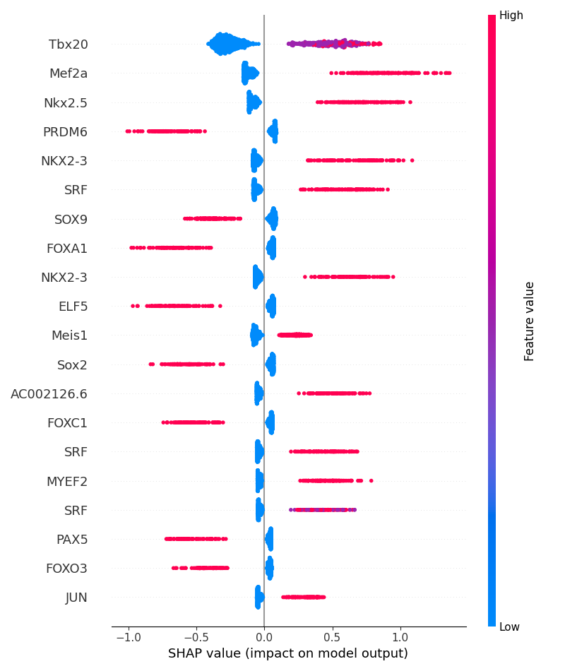
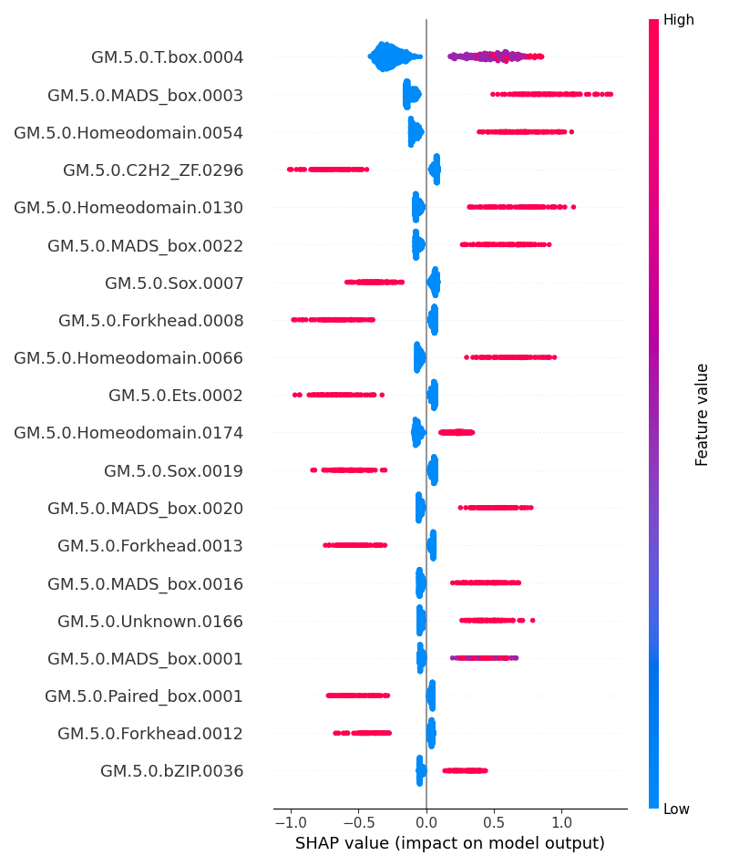
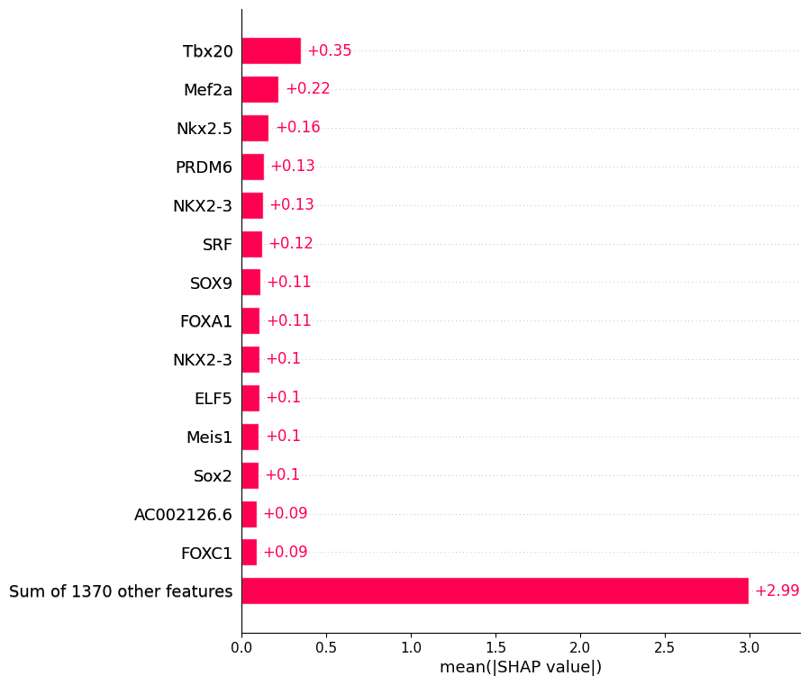
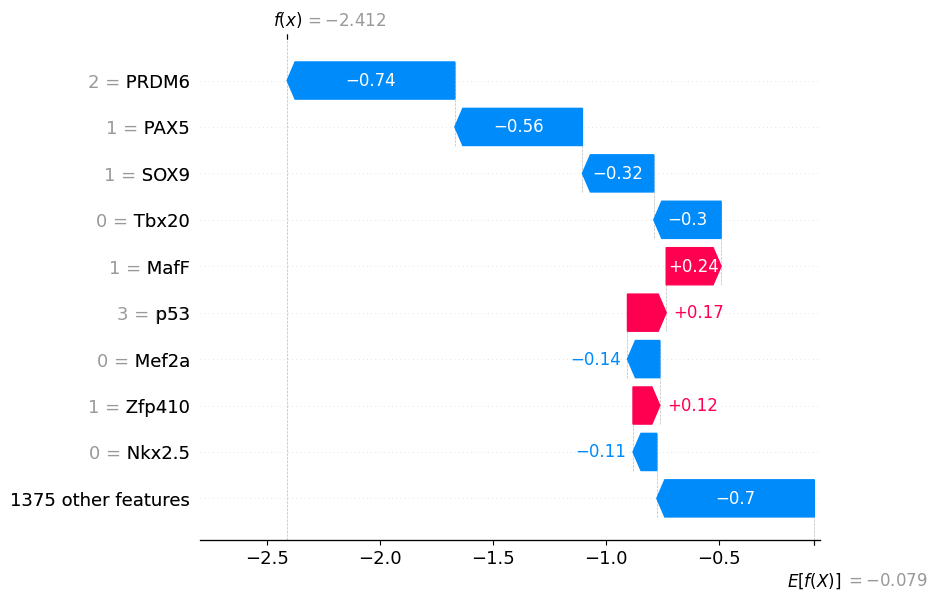
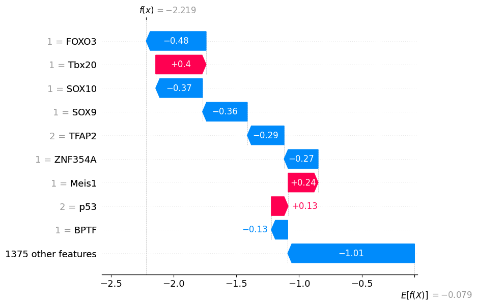
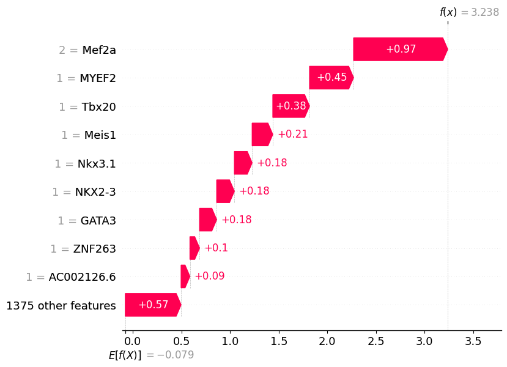

# Bag-of-Motifs tutorial for Model Interpretation

For this tutorial, we will calculate SHAP values to evaluate the contribution of each motif to the classification carried out by our model. 
SHAP stands for SHapley Additive exPlanations, SHAP values are a concept from game theory to measure the contribution of each player to a game [5]. 
It would be better to create a python virtual environment to calculate SHAP values. 
SHAP values are calculated for each motif and for each CRE. 
SHAP values can be positive or negative indicating whether they influence the prediction of the model towards the target class (positive values) or the background class (negative values).


### Create python environment and install dependencies

```Shell
python3 -m venv /path/to/shap_venv
source /path/to/shap_venv/bin/activate
pip install --upgrade pip
python3 -m pip install xgboost
python3 -m pip install sklearn
python3 -m pip install matplotlib
python3 -m pip install numpy
python3 -m pip install pandas
python3 -m pip install shap
```

**Note that** all scripts should be executed from a linux command line, unless otherwise stated.

Please activate python environment **shap_venv** and work on **/BOM/scripts/binary/** path

### Step_1 SHAP value calculation
**Using "BOM_SHAP.py"** to calculate and save the SHAP values of trained model


```R
python BOM_SHAP.py --help
```

    usage: BOM_SHAP.py [-h] [--xgb_model XGB_MODEL] [--train_data TRAIN_DATA]
                       [--out_file OUT_FILE]
    
    Script to calculate and save SHAP values for a binary model
    
    optional arguments:
      -h, --help            show this help message and exit
      --xgb_model XGB_MODEL
                            Path to XGBoost model file
      --train_data TRAIN_DATA
                            Path to training data file
      --out_file OUT_FILE   Path to output file (.txt)


```R
python BOM_SHAP.py --xgb_model Cardiomyocytes_vs_other.bin --train_data Cardiomyocytes_vs_other_train.txt --out_file Cardiomyocytes_vs_other_SHAP.txt
```

    Reading model...
    Reading data...
    Calculating SHAP values...
    Saving SHAP values...
    Done


We can see we have a SHAP value for each motif and each CRE. Columns represent different motifs, the name of the column represents the motif ID in the motif database. CRE are represented by their coordinates in the row names.

### Step_2 Model Interpretation

We can interpret the model from various perspectives with different visualization styles.

- make **SHAP beeswarm plots**  
- make **SHAP barplots** 
- make **Waterfall plots** 

>Please refer to ```BOM_SHAP_beeswarm.py --help```, ```BOM_SHAP_barplot.py --help``` and ```BOM_SHAP_waterfall.py --help```, respectively

###  SHAP beeswarm plots

SHAP beeswarm plots display the SHAP values for each CRE for a specified number of motifs. 
Here, motifs are ranked based on the sum of the absolute SHAP values, a measure of the overall motif importance. 
The colour of the dots is given by the normalised value of motif counts to a range from zero to one. 
GIMME motifs are clusters of very similar motifs recognized by different transcription factors (TF). 
The motif names displayed represent the first TF name included in the annotation of GIMME motifs.

**Using "BOM_SHAP_beeswarm.py"**, you can define whether to display the ID of the motif, as in the database, or a transcription factor name (default). 

**Note that** the script "BOM_SHAP_beeswarm.py" will display motif names, by default.


```R
python BOM_SHAP_beeswarm.py --help 
```

    usage: BOM_SHAP_beeswarm.py [-h] [--xgb_model XGB_MODEL]
                                [--train_data TRAIN_DATA] [--out_file OUT_FILE]
                                [--motif_names MOTIF_NAMES] [--out_SHAP OUT_SHAP]
                                [--max_display MAX_DISPLAY] [--features FEATURES]
                                [--feature_names FEATURE_NAMES [FEATURE_NAMES ...]]
                                [--plot_type {dot,bar,violin,compact_dot}]
                                [--color COLOR] [--axis_color AXIS_COLOR]
                                [--title TITLE] [--alpha ALPHA] [--show SHOW]
                                [--sort SORT] [--color_bar COLOR_BAR]
                                [--plot_size PLOT_SIZE]
                                [--layered_violin_max_num_bins LAYERED_VIOLIN_MAX_NUM_BINS]
                                [--class_names CLASS_NAMES [CLASS_NAMES ...]]
                                [--class_inds CLASS_INDS [CLASS_INDS ...]]
                                [--color_bar_label COLOR_BAR_LABEL] [--cmap CMAP]
                                [--auto_size_plot AUTO_SIZE_PLOT AUTO_SIZE_PLOT]
                                [--use_log_scale USE_LOG_SCALE]
    
    Script to produce a beeswarm plot of motif SHAP values in a binary model.
    
    optional arguments:
      -h, --help            show this help message and exit
      --xgb_model XGB_MODEL
                            Path to XGBoost model file
      --train_data TRAIN_DATA
                            Path to training data file
      --out_file OUT_FILE   Path to output PDF or png file
      --motif_names MOTIF_NAMES
                            Whether to use the motif names instead of motif IDs
                            (default: True)
      --out_SHAP OUT_SHAP   Path to output SHAP values
      --max_display MAX_DISPLAY
                            Number of motifs to display (default: 20)
      --features FEATURES   Path to features file
      --feature_names FEATURE_NAMES [FEATURE_NAMES ...]
                            List of feature names
      --plot_type {dot,bar,violin,compact_dot}
                            Type of summary plot
      --color COLOR         Color for the plot
      --axis_color AXIS_COLOR
                            Color for the plot axis
      --title TITLE         Title for the plot
      --alpha ALPHA         Transparency of the plot
      --show SHOW           Whether to display the plot
      --sort SORT           Whether to sort the features
      --color_bar COLOR_BAR
                            Whether to show the color bar
      --plot_size PLOT_SIZE
                            Size of the plot. "auto" (default), float, (float,
                            float), or None.
      --layered_violin_max_num_bins LAYERED_VIOLIN_MAX_NUM_BINS
                            Maximum number of bins for layered violin plot
      --class_names CLASS_NAMES [CLASS_NAMES ...]
                            List of class names
      --class_inds CLASS_INDS [CLASS_INDS ...]
                            Indices of classes to display
      --color_bar_label COLOR_BAR_LABEL
                            Label for the color bar
      --cmap CMAP           Colormap for the plot
      --auto_size_plot AUTO_SIZE_PLOT AUTO_SIZE_PLOT
                            Size of the plot
      --use_log_scale USE_LOG_SCALE
                            Whether to use a logarithmic scale


**In this example**, we interperate cardiomycyte-specific CRE classification. 
One plot displays motifs name and the other displays motif IDs (by setting '--motif_names' to False).

- SHAP_beeswarm plot (display **motif names**)
- SHAP_beeswarm plot (display **motif IDs**)


```R
python BOM_SHAP_beeswarm.py --xgb_model=Cardiomyocytes_vs_other.bin --train_data=Cardiomyocytes_vs_other_train.txt --out_file=Cardiomyocytes_vs_other_SHAP_beeswarmv1.png 

from IPython.display import Image
# get the image
Image("Cardiomyocytes_vs_other_SHAP_beeswarmv1.png", width=500, height=500)
```


    

    


```R
python BOM_SHAP_beeswarm.py --xgb_model=Cardiomyocytes_vs_other.bin --train_data=Cardiomyocytes_vs_other_train.txt --out_file=Cardiomyocytes_vs_other_SHAP_beeswarmv2.png --motif_names=False

from IPython.display import Image
# get the image
Image("Cardiomyocytes_vs_other_SHAP_beeswarmv2.png", width=500, height=500)
```


    

    


### SHAP bar plot of motif importance

SHAP barplots display an overall value of motif importance, defined as the mean of absolute SHAP values for each motif. 
By default the top 10 features are shown. 

**Using "BOM_SHAP_barplot.py"**, you can define whether to display motif names or motif IDs by setting '--motif_names'.


```R
python BOM_SHAP_barplot.py --help
```

    usage: BOM_SHAP_barplot.py [-h] [--xgb_model XGB_MODEL]
                               [--train_data TRAIN_DATA] [--out_file OUT_FILE]
                               [--motif_names MOTIF_NAMES] [--out_SHAP OUT_SHAP]
                               [--max_display MAX_DISPLAY]
                               [--order ORDER [ORDER ...]]
                               [--hclustering HCLUSTERING]
                               [--clustering_cutoff CLUSTERING_CUTOFF]
                               [--merge_cohorts MERGE_COHORTS]
                               [--show_data SHOW_DATA] [--show SHOW]
    
    Script to produce a SHAP barplot of overall motif importance in a BOM binary
    model.
    
    optional arguments:
      -h, --help            show this help message and exit
      --xgb_model XGB_MODEL
                            Path to XGBoost model file
      --train_data TRAIN_DATA
                            Path to training data file
      --out_file OUT_FILE   Path to output PDF or png file
      --motif_names MOTIF_NAMES
                            Whether to use the motif names instead of motif IDs
                            (default: True)
      --out_SHAP OUT_SHAP   Path to output SHAP values
      --max_display MAX_DISPLAY
                            Number of motifs to display (default: 10). This
                            determines the maximum number of motifs to include in
                            the plot.
      --order ORDER [ORDER ...]
                            Order of the motifs. It can be a list of motif names
                            or a function that takes an shap.Explanation object
                            and returns a list of motif names.
      --hclustering HCLUSTERING
                            Whether to perform hierarchical clustering.
      --clustering_cutoff CLUSTERING_CUTOFF
                            Cutoff threshold for clustering (default: 0.5). Motifs
                            with a similarity below this cutoff will not be merged
                            in the dendrogram.
      --merge_cohorts MERGE_COHORTS
                            Whether to merge motifs from different cohorts
                            (default: False). If set to True, motifs from
                            different cohorts will be merged.
      --show_data SHOW_DATA
                            Option to show the data on the plot. Options include
                            "auto" (default), "data", or "None".
      --show SHOW           Whether to display the plot.


```R
python BOM_SHAP_barplot.py --xgb_model=Cardiomyocytes_vs_other.bin --train_data=Cardiomyocytes_vs_other_train.txt --out_file=Cardiomyocytes_vs_other_bar1.png --max_display=15 --motif_names=True

from IPython.display import Image
# get the image
Image("Cardiomyocytes_vs_other_bar1.png", width=500, height=500)
```


    

    


### Waterfall plot of local motif importance 

Given that SHAP values are calculated for each CRE, we can evaluate the local explanation of individual CRE. 

**In this example**, we will make a waterfall plot and it will show the sign (direction) of SHAP values for indivisual CREs in different colors. 
You can find the SHAP value and feature value of each motif. The feature value is the count of each type of motif in the CRE sequence. 

Here, we selected **three cardiomyocyte-specific CREs** as examples. 
As in previous plots, motifs are ranked based on their absolute SHAP values.


```R
python BOM_SHAP_waterfall.py --help
```

    usage: BOM_SHAP_waterfall.py [-h] [--xgb_model XGB_MODEL]
                                 [--train_data TRAIN_DATA] [--regions REGIONS]
                                 [--motif_names MOTIF_NAMES]
                                 [--max_display MAX_DISPLAY] [--show SHOW]
                                 [--out_format OUT_FORMAT]
    
    Script to perform operations on a model.
    
    optional arguments:
      -h, --help            show this help message and exit
      --xgb_model XGB_MODEL
                            Path to XGBoost model file
      --train_data TRAIN_DATA
                            Path to training data file
      --regions REGIONS     Path to regions IDs for local explanation
      --motif_names MOTIF_NAMES
                            Whether to use the motif names instead of motif IDs
                            (default: True)
      --max_display MAX_DISPLAY
                            Number of motifs to display (default: 10)
      --show SHOW           Whether to display the plot
      --out_format OUT_FORMAT
                            Format for output plots. Either png or pdf.


```R
python BOM_SHAP_waterfall.py --xgb_model=Cardiomyocytes_vs_other.bin --train_data=Cardiomyocytes_vs_other_train.txt --regions=CRE_sample_card
```

    Reading model...
    Reading data...
    Calculating SHAP values...
    Reading GIMME motifs annotation...
    Saving beeswarm plot...
    Saving 1_39855911_39856411_waterfall.png ...
    Figure(800x650)
    Saving 2_157923362_157923862_waterfall.png ...
    Figure(800x650)
    Saving 9_23116275_23116775_waterfall.png ...
    Figure(800x650)
    Done


#### Example CRE_1: cardiomyocyte-specific CRE


```R
from IPython.display import Image
# get the image
Image("1_39855911_39856411_waterfall.png", width=500, height=500)
```


    

    


#### Example CRE_2: cardiomyocyte-specific CRE


```R
Image("2_157923362_157923862_waterfall.png", width=500, height=500)
```


    

    


#### Example CRE_3: cardiomyocyte-specific CRE


```R
Image("9_23116275_23116775_waterfall.png", width=500, height=500)
```


    

    


### Step_3 Figure out the most important motif in CRE binary classification

To figure out the most important motif set, we rank motifs by their overall importance in the classification task.
The motif ranking implemented in SHAP plots could be useful for multiple downstream analysis. 

**Using "rank_motifs.R"**, we can get this ranking based on either the sum of absolute SHAP or mean of the absolute SHAP per motif. 

In this example, we will rank motifs by two ways respectively by setting '--rank_type' and note that the results are highly consistent for both ranking ways.
 
- ranking based on **the sum of absolute SHAP** per motif
- ranking based on **the mean of the absolute SHAP** per motif


```R
Rscript rank_motifs.R --help
```

    Usage: Rscript rank_motifs.R [parameters]
    
    Parameters:
      --shap_file=<file>       Path to the SHAP values file
      --out_file=<file>      Path to save the motifs ranked by SHAP
      --rank_type=<file>      Rank type. Either 'sum' or 'mean' 
    


#### Way_1: Ranking by **the mean of absolute SHAP** per motif


```R
Rscript rank_motifs.R --shap_file=Cardiomyocytes_vs_other_SHAP.txt --out_file=Cardiomyocytes_vs_other_Motif_rank1 --rank_type=mean
```

    Reading SHAP values...
    Ranking motifs by SHAP...
    Saving ranked motifs...
    Done


```R
head Cardiomyocytes_vs_other_Motif_rank1
```

    mean_abs_SHAP
    GM.5.0.T.box.0004 0.348914314613564
    GM.5.0.MADS_box.0003 0.217864508280769
    GM.5.0.Homeodomain.0054 0.159735312075843
    GM.5.0.C2H2_ZF.0296 0.130275805270133
    GM.5.0.Homeodomain.0130 0.12624345631612
    GM.5.0.MADS_box.0022 0.120348175534041
    GM.5.0.Sox.0007 0.10757551501981
    GM.5.0.Forkhead.0008 0.106609145923373
    GM.5.0.Homeodomain.0066 0.104904772688682


#### Way_2: Ranking by **the sum of absolute SHAP** per motif


```R
Rscript rank_motifs.R --shap_file=Cardiomyocytes_vs_other_SHAP.txt --out_file=Cardiomyocytes_vs_other_Motif_rank2 --rank_type=sum
```

    Reading SHAP values...
    Ranking motifs by SHAP...
    Saving ranked motifs...
    Done


```R
head Cardiomyocytes_vs_other_Motif_rank2
```

    sum_abs_SHAP
    GM.5.0.T.box.0004 362.521972883493
    GM.5.0.MADS_box.0003 226.361224103719
    GM.5.0.Homeodomain.0054 165.964989246801
    GM.5.0.C2H2_ZF.0296 135.356561675668
    GM.5.0.Homeodomain.0130 131.166951112449
    GM.5.0.MADS_box.0022 125.041754379869
    GM.5.0.Sox.0007 111.770960105583
    GM.5.0.Forkhead.0008 110.766902614385
    GM.5.0.Homeodomain.0066 108.996058823541


### References

1. Pijuan-Sala, B., Wilson, N. K., Xia, J., Hou, X., Hannah, R. L., Kinston, S., ... & Göttgens, B. (2020). Single-cell chromatin accessibility maps reveal regulatory programs driving early mouse organogenesis. Nature cell biology, 22(4), 487-497.
2. Bruse, N., & Heeringen, S. J. V. (2018). GimmeMotifs: an analysis framework for transcription factor motif analysis. BioRxiv, 474403.
3. Charles E. Grant, Timothy L. Bailey and William Stafford Noble, "FIMO: Scanning for occurrences of a given motif", Bioinformatics 27(7):1017-1018, 2011. [full text]
4. Quinlan, A. R., & Hall, I. M. (2010). BEDTools: a flexible suite of utilities for comparing genomic features. Bioinformatics, 26(6), 841-842.
5. Lundberg, S. M., Erion, G., Chen, H., DeGrave, A., Prutkin, J. M., Nair, B., ... & Lee, S. I. (2020). From local explanations to global understanding with explainable AI for trees. Nature machine intelligence, 2(1), 56-67.
